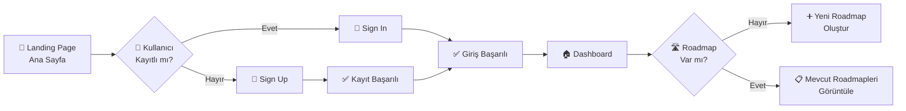

```mermaid
graph LR
    G["🏠 Dashboard"]
    I["➕ Yeni Roadmap"] --> K["🎯 İlgi Alanı<br/>Seçimi"]

    K --> L["🤖 AI ile Roadmap<br/>Oluşturma"]
    L --> M["📊 Kişiselleştirilmiş<br/>Roadmap"]

    M --> N["💬 AI Chat<br/>Mentörlük"]


    N --> O["📈 İlerleme<br/>Takibi"]
    O --> P["🏆 Başarımlar<br/>Kazanma"]

    G --> Q["👤 Profile"]
    G --> R["📊 Analytics"]
    G --> S["⚙️ Settings"]

    P --> T["🎖️ Achievement<br/>Görüntüleme"]
    R --> U["📈 Milestone<br/>Grafikleri"]

    N --> V{"💡 Yeni Soru<br/>veya Rehberlik?"}
    V -->|"Evet"| N
    V -->|"Hayır"| W["✨ Devam Eden<br/>Gelişim"]
